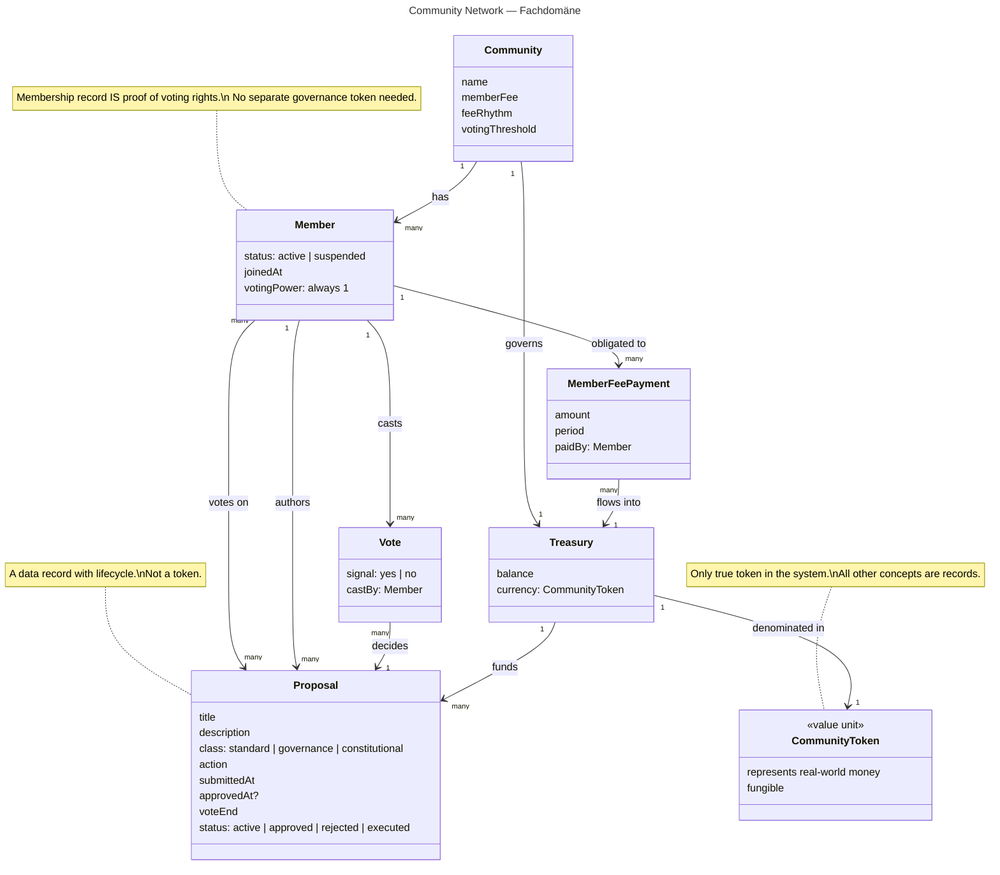

# Domain model

> For anyone who wants to go deeper into the requirements engineering behind
> GAIA. This diagram captures the full *Fachdomäne* (problem domain) — the
> real-world concepts the system models, their relationships, and the
> design choices that simplify the on-chain implementation.

## Class diagram

## Reading guide

| Concept | Key insight |
|---|---|
| **Community** | The root aggregate — owns the member set, treasury, and governance parameters. |
| **Member** | A storage record, not a token. The record itself *is* the proof of voting rights. |
| **CommunityToken** | The only true token in the system. Everything else (members, proposals, votes) is a data record. |
| **Treasury** | Always denominated in CommunityToken. Balance invariant: never negative. |
| **Proposal** | A lifecycle entity (active → approved/rejected → executed) carrying a typed governance action. Never a token. |
| **Vote** | One signal per member per proposal. Equal weight — no quadratic or stake-weighted voting. |
| **MemberFeePayment** | The funding mechanism: member fees flow into the treasury, proposals flow out. |

## Design decisions reflected here

- **No governance token.** Voting power derives from active membership status,
  not from token holdings. This is a deliberate simplification that keeps the
  system egalitarian.
- **Single currency.** CommunityToken is the only fungible asset. There is no
  secondary staking or reward token.
- **Records over tokens.** Members, proposals, and votes are storage records
  with lifecycle states — not NFTs, not transferable assets.
- **Typed governance actions.** Proposals are no longer only treasury-withdrawal
  records; they can also govern thresholds, voting periods, execution delay,
  membership parameters, and runtime upgrades.
- **Implementation simplifications vs. domain.** The domain describes a
  `pending` member status and `draft`/`disputed` proposal states as aspirational
  concepts. The current implementation omits them: candidates awaiting admission
  move through explicit membership proposals, and proposals are submitted
  directly into the `Active` state with no draft or dispute phase.
